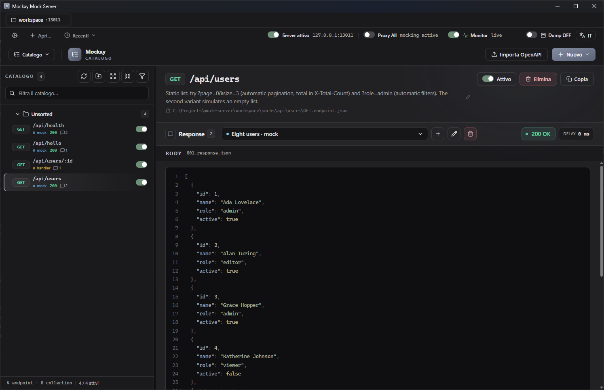
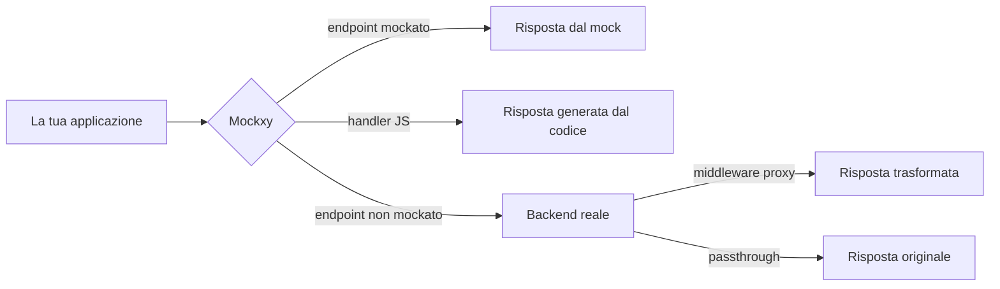

<div align="center">



# Mockxy

[](README.md)
[](README.it.md)

**Mock server HTTP con proxy verso il backend reale: simuli solo gli endpoint che ti servono, tutto il resto passa.**


</div>

---

Mockxy è un mock server pensato per lo sviluppo frontend: si mette tra la tua applicazione e il backend e risponde al posto del backend **solo per le rotte che hai deciso di mockare**. Tutte le altre richieste vengono inoltrate in modo trasparente al backend reale, come se Mockxy non esistesse.

Non devi mockare tutto per iniziare: parti con zero mock, lavora normalmente e aggiungi un mock alla volta — a mano, importando una specifica OpenAPI, o **con un click a partire da una richiesta reale catturata dal monitor**.

## Indice

- [Mockxy](#mockxy)
  - [Indice](#indice)
  - [Perché Mockxy](#perché-mockxy)
  - [Caratteristiche](#caratteristiche)
  - [Come funziona](#come-funziona)
  - [Avvio rapido](#avvio-rapido)
  - [Usare Mockxy nel tuo progetto](#usare-mockxy-nel-tuo-progetto)
  - [L'interfaccia web](#linterfaccia-web)
    - [Catalogo dei mock](#catalogo-dei-mock)
    - [Monitor](#monitor)
    - [Controlli globali](#controlli-globali)
  - [I mock sono file](#i-mock-sono-file)
  - [Risposte dinamiche: gli handler](#risposte-dinamiche-gli-handler)
    - [Riusare dati salvati: `data()`](#riusare-dati-salvati-data)
  - [Trasformare le risposte del backend: i middleware](#trasformare-le-risposte-del-backend-i-middleware)
  - [Import da OpenAPI](#import-da-openapi)
  - [Dati riusabili: la pagina Dati](#dati-riusabili-la-pagina-dati)
  - [Configurazione](#configurazione)
  - [API di amministrazione](#api-di-amministrazione)
  - [Docker](#docker)
  - [App desktop](#app-desktop)
  - [Sicurezza e limiti](#sicurezza-e-limiti)
  - [Risoluzione dei problemi](#risoluzione-dei-problemi)
  - [Struttura del repository](#struttura-del-repository)
  - [Sviluppo e test](#sviluppo-e-test)
  - [Licenza](#licenza)

## Perché Mockxy

Mockxy nasce da situazioni che prima o poi capitano in quasi tutti i progetti. L'idea di fondo è che mockare non è una scelta tutto-o-niente: il confine tra "mockato" e "reale" si sposta di continuo durante la vita di un progetto, e Mockxy è costruito proprio attorno a questo.

- **All'inizio il backend non c'è.** L'API è concordata ma non implementata: mocki gli endpoint che ti servono e il frontend parte subito. E quando il backend matura non butti via niente — disabiliti i mock una zona alla volta e quelle richieste tornano semplicemente a passare verso il backend reale.

- **Il backend di staging è condiviso… e ogni tanto qualcuno resetta il database.** Hai passato la mattinata a inserire dati dalle maschere dell'app per provare le interfacce, e il reseeding di turno spazza via tutto. Con Mockxy in mezzo fai data entry contro il backend vero, poi catturi dal monitor le risposte con i tuoi dati ben popolati e le congeli in mock: al prossimo reset, i tuoi scenari sono ancora lì.

- **Il contratto evolve prima del backend.** Aggiorni la specifica OpenAPI e rigeneri il client API, ma l'endpoint reale non è ancora allineato. Intercetti la risposta vera, la trasformi in mock e ci aggiungi i campi che il nuovo contratto prevede — oppure li aggiungi al volo sopra la risposta reale con un middleware, senza rinunciare ai dati veri.

- **Un caso è difficile da riprodurre.** Ti serve un 500, un timeout, una lista vuota, un dataset particolare: fissi la risposta di quel singolo endpoint e lasci passare tutto il resto.

- **Vuoi lavorare offline o isolarti da un ambiente instabile.** I mock vivono su file nel tuo repository: l'intero set di risposte è riproducibile e condivisibile con il team via git.

Nessuno di questi è lo scenario di sviluppo da manuale — nessun team è perfetto. Ma è quello che succede davvero, e avere una via d'uscita pratica fa la differenza finché il backend non torna stabile. Gli stessi scenari, come percorsi passo-passo con i rimandi alle pagine di dettaglio, sono in [docs/it/SCENARI.md](docs/it/SCENARI.md).

## Caratteristiche

- 🎯 **Mock selettivi con fallback**: risponde ai mock definiti, inoltra il resto al backend reale (o restituisce 404 in modalità solo-mock).
- 🖥️ **Interfaccia web completa** (italiano e inglese): catalogo dei mock con collezioni, editor di risposte, monitor del traffico, import OpenAPI.
- 📡 **Monitor in tempo reale**: cattura richieste e risposte (mock e proxy), con filtri, esportazione, copia come cURL e **creazione di mock direttamente dal traffico osservato**, anche in blocco.
- 📁 **Mock come file**: ogni endpoint è una cartella con file JSON leggibili, versionabili in git e modificabili anche a mano, con ricarica a caldo.
- 🔀 **Più varianti di risposta per endpoint**: 200 con dati, 404, 500, lista vuota… e scegli quella attiva con un interruttore.
- ⏱️ **Latenze simulate**: ritardo per singola risposta o ritardo globale per emulare una rete lenta.
- 📄 **Paginazione e filtri automatici**: se il body è un array, `?page=0&size=10` restituisce solo la pagina richiesta (totale nell'header `X-Total-Count`) e `?chiave=valore` filtra gli elementi per uguaglianza (case-insensitive di default).
- 🧩 **Handler JavaScript**: quando un JSON statico non basta, generi la risposta con una funzione che riceve parametri, query, header e body della richiesta.
- 🗂️ **File dati riusabili**: carichi collezioni JSON nella pagina Dati e le richiami dagli handler con `data("nome")` per servirle o manipolarle, senza incollarle nel codice.
- 🔧 **Middleware proxy**: intercetti la risposta del backend reale e la trasformi prima che arrivi all'applicazione.
- 📥 **Import OpenAPI / Swagger**: da una specifica 3.x o 2.0 genera un mock per ogni endpoint, con corpi ricavati da esempi e schemi — una base solida da rifinire a mano.
- 🚦 **Interruttori globali**: sospendi tutti i mock (proxy totale) o spegni Mockxy logicamente senza fermare il processo.
- 📦 **Tre modi d'uso**: server Node.js in locale, container Docker, oppure app desktop portable per Windows con gestione di più workspace.

## Come funziona



Per ogni richiesta in arrivo Mockxy cerca l'endpoint corrispondente tra quelli definiti (metodo + percorso, con supporto ai parametri di percorso e alla query string; vince sempre la rotta più specifica). A quel punto:

1. se l'endpoint ha una **risposta mock** attiva, risponde con quella (status, header, body, eventuale ritardo);
2. se la risposta attiva è un **handler**, esegue il tuo codice JavaScript e risponde con il risultato;
3. se non c'è nessun mock e il **proxy fallback** è attivo, inoltra la richiesta a `BACKEND_URL` e restituisce la risposta del backend — eventualmente trasformata da un **middleware**;
4. se il fallback è disattivato risponde `404 Mock Not Found`; se serve il backend ma `BACKEND_URL` non è configurato, `501 Backend Not Configured`.

Un dettaglio da sapere: prima viene scelta la rotta più specifica per il percorso, poi si verifica il metodo. Se la rotta selezionata non definisce il metodo richiesto, la richiesta va al fallback — non viene cercata una rotta meno specifica. Le regole complete di matching e specificità sono in [docs/it/PATH.md](docs/it/PATH.md).

Le connessioni **WebSocket** non seguono questo percorso: essendo un altro protocollo non hanno mock, e Mockxy le inoltra così come sono al backend (serve `BACKEND_URL` e il proxy fallback attivo). Va bene per le app che mockano le API HTTP ma tengono una connessione live verso il backend reale per notifiche o aggiornamenti. Dettagli in [docs/it/WEBSOCKET.md](docs/it/WEBSOCKET.md).

Ogni risposta include l'header **`x-mock-source`** (`mock`, `handler`, `middleware`, `backend`…): dice a colpo d'occhio chi ha generato la risposta, ed è il primo posto dove guardare quando qualcosa non torna. Il dettaglio della decisione, l'inoltro al backend, errori/timeout e la tassonomia completa dell'header sono in [docs/it/PROXY.md](docs/it/PROXY.md).

Due interruttori globali cambiano il comportamento al volo, senza riavviare: **proxy totale** (ignora tutti i mock e inoltra tutto al backend, il monitor continua a registrare) e **server spento** (puro passthrough, senza nemmeno il monitor).

## Avvio rapido

Requisiti: [Node.js](https://nodejs.org) 24 o superiore (la LTS corrente; le distribuzioni desktop e Docker portano con sé il proprio runtime e non dipendono dal Node di sistema).

```bash
git clone https://github.com/<tuo-utente>/mockxy.git
cd mockxy

npm install              # dipendenze del server
npm run install:frontend # dipendenze dell'interfaccia web
cp .env.example .env     # configurazione di partenza

npm run dev:backend      # server su http://localhost:3000
npm run dev:frontend     # interfaccia su http://localhost:4207 (in un secondo terminale)
```

Il repository include un workspace dimostrativo con qualche mock già pronto, quindi puoi verificare subito che tutto funzioni:

```bash
curl http://localhost:3000/api/hello
# {"hello":"world", ...}
```

Poi apri **http://localhost:4207** per gestire i mock dall'interfaccia web.

> In alternativa puoi partire con [Docker](#docker) (`docker compose up`) o con l'[app desktop](#app-desktop), che non richiede nessuna installazione.

## Usare Mockxy nel tuo progetto

L'idea è semplice: la tua applicazione deve parlare con Mockxy invece che con il backend, e Mockxy deve sapere dov'è il backend vero.

**1. Indica a Mockxy il backend reale** nel file `.env`:

```bash
BACKEND_URL=http://localhost:8080
```

**2. Fai puntare l'app a Mockxy.** Se usi il proxy del dev server, non devi toccare il codice: le chiamate restano relative e cambia solo la destinazione del proxy.

Con **Angular** (`proxy.conf.json`):

```json
{
  "/api": {
    "target": "http://localhost:3000",
    "secure": false
  }
}
```

Con **Vite** (`vite.config.js`):

```js
export default {
  server: {
    proxy: {
      "/api": "http://localhost:3000"
    }
  }
};
```

Qualsiasi altro client va bene allo stesso modo: basta usare `http://localhost:3000` come base URL delle API.

Da questo momento tutte le chiamate attraversano Mockxy: quelle mockate rispondono con i tuoi dati, le altre arrivano al backend reale. Il monitor le registra tutte — ed è il punto di partenza più comodo per creare nuovi mock. Il confronto tra le due strade di collegamento (proxy del dev server o chiamata diretta cross-origin) è in [docs/it/FRONTEND.md](docs/it/FRONTEND.md).

## L'interfaccia web

<!-- Screenshot consigliato: pagina Mocks con catalogo e editor affiancati -->

L'interfaccia (disponibile in italiano e inglese) è organizzata in tre aree principali.

### Catalogo dei mock

L'elenco di tutti gli endpoint, organizzabile in **collezioni** (anche annidate, riordinabili con drag & drop), con ricerca e filtri per metodo, tipo e stato. Per ogni endpoint puoi:

- definire metodo, percorso (con parametri: `/utenti/:id`), descrizione;
- creare **più varianti di risposta** e scegliere quella attiva: status, header (con preset per i casi comuni), body JSON/testo con editor e validazione, oppure un file binario;
- impostare un **ritardo in millisecondi** per simulare latenza;
- abilitare/disabilitare il singolo endpoint o un'intera collezione;
- duplicare un endpoint su un nuovo metodo/percorso.

Semantiche delle collezioni, validazioni dell'editor e upload di file binari sono in [docs/it/CATALOGO.md](docs/it/CATALOGO.md).

### Monitor

Il traffico che attraversa Mockxy, in tempo reale: metodo, URL, status, latenza e **origine della risposta** (mock, handler, middleware, backend). Per ogni voce puoi ispezionare header e body di richiesta e risposta, con filtri per metodo, classe di status (2xx…5xx), origine e un comodo interruttore "solo richieste non mockate".

Da qui nasce il flusso di lavoro più efficace: intercetti una risposta reale del backend e la trasformi in mock con un click, già popolata con status, header e body. Funziona anche in blocco su più richieste selezionate. È il modo più rapido per mettere al sicuro i dati che hai inserito a mano su un ambiente condiviso, prima che il prossimo reset del database se li porti via. In più: esportazione in JSON, copia come cURL, salto diretto dalla richiesta al mock che l'ha servita.

Il monitor tiene le ultime 250 richieste in memoria e può riversare tutto su disco (formato NDJSON con rotazione automatica): la pagina **Storico** permette di sfogliare l'archivio e creare mock in blocco anche da lì. Gli header sensibili (`Authorization`, `Cookie`, chiavi API) vengono mascherati. Esclusioni, limiti di cattura e regole del travaso traffico→mock sono in [docs/it/MONITOR.md](docs/it/MONITOR.md); accensione, rotazione e retention dell'archivio in [docs/it/STORICO.md](docs/it/STORICO.md).

### Controlli globali

Dalla barra superiore puoi sospendere temporaneamente i mock (**proxy totale** verso il backend) o disattivare del tutto il server, oltre a lanciare l'**import OpenAPI** e cambiare lingua. Le tre modalità e i loro effetti sono in [docs/it/CONTROLLI.md](docs/it/CONTROLLI.md); la lingua in [docs/it/LINGUA.md](docs/it/LINGUA.md).

## I mock sono file

Tutto ciò che fai dall'interfaccia finisce in normali file JSON dentro la cartella dei mock — e vale anche il contrario: puoi creare e modificare i mock a mano con il tuo editor, e Mockxy li ricarica a caldo. Questo significa che l'intero set di mock è **versionabile in git e condivisibile con il team**. La struttura completa della cartella (cosa si condivide e cosa resta locale) è documentata in [docs/it/WORKSPACE.md](docs/it/WORKSPACE.md).

La struttura è una cartella per endpoint, che rispecchia il percorso dell'API:

```
workspace/mocks/
├── api/utenti/
│   ├── GET.endpoint.json          # definizione dell'endpoint GET /api/utenti
│   └── GET.responses/
│       ├── 001.response.json      # variante: 200 con dati
│       └── 002.response.json      # variante: lista vuota
├── api/utenti/{id}/
│   ├── GET.endpoint.json          # GET /api/utenti/:id
│   └── GET.responses/
│       └── 001.response.json
└── .collections.json              # organizzazione in collezioni per la UI
```

Il file endpoint dichiara percorso, stato e varianti disponibili (formato completo, regole di validazione e comportamento sugli errori in [docs/it/ENDPOINT.md](docs/it/ENDPOINT.md)):

```json
{
  "method": "GET",
  "path": "/api/utenti/:id",
  "description": "Dettaglio utente",
  "enabled": true,
  "responseFiles": ["001.response.json", "002.response.json"],
  "selectedResponseFile": "001.response.json"
}
```

Ogni variante di risposta è un file autonomo (formato completo dei tre tipi — mock, handler, middleware — in [docs/it/RESPONSE.md](docs/it/RESPONSE.md)):

```json
{
  "type": "mock",
  "title": "Utente trovato",
  "status": 200,
  "headers": { "x-esempio": "true" },
  "delayMs": 150,
  "body": { "id": 1, "nome": "Ada", "ruolo": "admin" }
}
```

In alternativa a `body` puoi usare `file` per servire un payload binario (immagini, PDF…). Il file viene letto dal disco **in streaming a ogni richiesta**, senza occupare memoria: puoi mockare anche download da centinaia di MB. Se non dichiari un `content-type` negli header, la risposta esce come `application/octet-stream`. Il `path` può includere anche una query string: a parità di percorso, la variante con query combaciante ha la precedenza.

**Paginazione automatica.** Se il body di un mock è un array — o un oggetto con un solo array di primo livello, come `{ "items": [...] }` — puoi chiamarlo con `?page=0&size=10`: Mockxy restituisce solo la pagina richiesta (numerazione da zero) e aggiunge l'header `X-Total-Count` con il numero totale di elementi. Definisci una volta il dataset completo e la paginazione viene da sé.

**Filtri automatici.** Sugli stessi body lista, ogni parametro di query il cui nome coincide con una chiave di primo livello degli elementi filtra la lista per uguaglianza: `?ruolo=admin` restituisce solo gli elementi con quel valore; parametri diversi si combinano in AND, lo stesso parametro ripetuto è un OR, i parametri sconosciuti vengono ignorati. Il confronto è case-insensitive di default (configurabile per workspace, o con `CASE_INSENSITIVE_FILTERS`), il filtro si applica prima della pagina e `X-Total-Count` riporta il totale filtrato. Regole complete e casi limite in [docs/it/LISTE.md](docs/it/LISTE.md).

> Se hai mock scritti nel vecchio formato v1, `node scripts/migrate-mocks-v2.js <cartella>` li converte automaticamente.

## Risposte dinamiche: gli handler

Quando una risposta statica non basta — vuoi far eco al body ricevuto, rispondere in base a un parametro, generare dati — una variante può essere un **handler**: un modulo JavaScript che riceve il contesto della richiesta e restituisce la risposta. Nessun contatto con il backend.

```js
// GET.responses/001.handler.js
module.exports = {
  async resolveResponse({ params, query, requestHeaders, jsonBody }) {
    if (!params.id) {
      return { status: 400, jsonBody: { error: "id mancante" } };
    }
    return {
      status: 200,
      headers: { "x-generato": "handler" },
      jsonBody: { id: params.id, filtro: query, ricevuto: jsonBody }
    };
  }
};
```

Il contesto include richiesta Express, parametri di percorso, query, header e body (grezzo, testuale o già parsato come JSON). Il risultato indica `status`, eventuali `headers` e un `body` testuale **oppure** un `jsonBody`. Gli handler si creano e si modificano anche dall'interfaccia, con template di partenza. Il contratto completo — contesto, formato del risultato, errori e limiti — è in [docs/it/HANDLER.md](docs/it/HANDLER.md).

L'esecuzione di un handler ha lo stesso timeout delle richieste verso il backend (`REQUEST_TIMEOUT_MS`, default 15 secondi): un handler che non produce una risposta in tempo — una promise che non risolve mai, una fetch senza timeout — riceve un **504** con l'errore registrato nel log, invece di lasciare la richiesta appesa.

### Riusare dati salvati: `data()`

Nel contesto dell'handler arriva anche `data`, una funzione che legge un file JSON dalla pagina **Dati** e ne restituisce il contenuto già parsato. Serve a tenere il dataset fuori dal codice: definisci una volta una collezione in un file e la richiami da uno o più handler, dove la filtri, la mappi, la componi.

```js
module.exports = {
  async resolveResponse({ query, data }) {
    const utenti = await data("utenti");          // legge workspace/files/utenti.json
    const attivi = utenti.filter((u) => u.attivo);
    return { jsonBody: query.q
      ? attivi.filter((u) => u.nome.includes(String(query.q)))
      : attivi };
  }
};
```

Il file si referenzia per **nome senza estensione** (`data("utenti")` → `utenti.json`); il nome è sempre minuscolo, e `data` tollera comunque maiuscole o un `.json` di troppo nel riferimento. La lettura avviene **solo quando chiami `data()`**: un file mai richiamato non viene mai aperto, e ogni chiamata rilegge dal disco restituendo una copia indipendente (le modifiche al file si vedono alla richiesta successiva, senza riavvii; mutare il risultato non tocca il file né gli altri handler). Se il file non esiste, non è JSON valido, o il nome è malformato, l'handler fallisce con il consueto **500** e il dettaglio — incluso *quali* file sono disponibili — finisce nel log.

Lo stesso `data()` è disponibile anche nei **middleware proxy** (vedi sotto), per arricchire la risposta reale del backend con dati tuoi.

## Trasformare le risposte del backend: i middleware

Il terzo tipo di variante è il **middleware proxy**: la richiesta arriva davvero al backend, ma prima che la risposta torni all'applicazione puoi ispezionarla e modificarla. Il caso d'uso tipico è il contratto che corre avanti rispetto all'implementazione: il backend risponde ancora nel formato vecchio e tu aggiungi i campi nuovi che il tuo client ormai si aspetta, continuando però a lavorare con dati reali. Torna utile anche per correggere un payload non ancora allineato o rimuovere header di troppo.

```js
// GET.responses/001.middleware.js
module.exports = {
  async transformResponse({ status, headers, jsonBody }) {
    return {
      status,
      headers: { ...headers, "x-trasformata": "true" },
      jsonBody: { ...jsonBody, note: "arricchita da Mockxy" }
    };
  }
};
```

I middleware sono pensati per payload di dimensioni ragionevoli, tipicamente JSON: la risposta viene bufferizzata fino a **10MB** (le compresse decodificate automaticamente, con tetto anti-bomba a 50MB) e oltre quel limite — o per gli stream come `text/event-stream` — passa all'applicazione integra ma non trasformata, con un avviso nel log e `x-mock-source: backend`. Un middleware che fallisce o va in timeout è **fail-open**: Mockxy registra l'errore e lascia passare la risposta originale del backend — nessuna richiesta resta mai appesa per colpa di un middleware. Il contratto completo di `transformResponse` — contesto, fusione degli header, casi limite — è in [docs/it/MIDDLEWARE.md](docs/it/MIDDLEWARE.md).

## Import da OpenAPI

Se hai una specifica **OpenAPI 3.0/3.1 o Swagger 2.0** (JSON o YAML), Mockxy può generare un mock per ogni endpoint dichiarato: percorso convertito nel formato interno, primo status 2xx come risposta, body ricavato dagli esempi della specifica o campionato dagli schemi. Regole di generazione, import incrementale e anteprima sono in [docs/it/OPENAPI.md](docs/it/OPENAPI.md).

L'import è pensato per darti **una base di lavoro completa in pochi secondi**, non mock perfetti: dopo l'import rifinisci i dati che contano davvero dall'editor. Dall'interfaccia hai un'anteprima di ciò che verrà creato prima di confermare (via API, `?dryRun=true`).

## Dati riusabili: la pagina Dati

La pagina **Dati** raccoglie file JSON che gli handler (e i middleware) richiamano con `data("nome")` — vedi [gli handler](#riusare-dati-salvati-data). Da qui carichi i file (solo `.json`, anche in blocco o per trascinamento), ne rivedi il contenuto, li rinomini o li elimini; il pulsante "copia riferimento" ti dà lo snippet pronto da incollare in un handler. I file finiscono in `FILES_DIR` (`workspace/files`) e sono versionati come i mock: il dataset di una demo viaggia con il repo. Contratto su disco, semantica di `data()` e dettagli della pagina sono in [docs/it/DATI.md](docs/it/DATI.md).

Ogni file mostra **da quali endpoint è usato** (riconoscendo i riferimenti `data("nome")` scritti come stringa letterale), e su questa mappa si appoggia la **rinomina sicura**: rinominando un file referenziato, Mockxy propone di riscrivere le occorrenze nei sorgenti che lo usano — riscrittura tutto-o-niente, con riepilogo finale e ricarica del runtime.

Il nome del file **è** il suo identificatore, quindi deve essere univoco; per evitare ambiguità tra sistemi operativi (Windows e macOS ignorano le maiuscole, Linux no) i nomi vengono sempre normalizzati in minuscolo, sia al caricamento sia alla rinomina. Il contenuto viene validato come JSON prima di essere scritto: un file malformato viene rifiutato senza toccare il disco.

Sulle dimensioni: **ogni chiamata `data()` rilegge il file dal disco**, quindi i file molto grandi su endpoint trafficati si pagano a ogni richiesta — la pagina segnala quelli oltre i 5 MB; il limite di caricamento è 25 MB.

## Configurazione

Tutta la configurazione passa da variabili d'ambiente (o da un file `.env`; parti da `.env.example`, che è commentato).

| Variabile                      | Default                        | Descrizione                                                                                                                                                                    |
| ------------------------------ | ------------------------------ | ------------------------------------------------------------------------------------------------------------------------------------------------------------------------------ |
| `PORT`                         | `3000`                         | Porta su cui ascolta il server                                                                                                                                                 |
| `HOST`                         | `127.0.0.1`                    | Interfaccia di rete su cui ascoltare; `0.0.0.0` per esporre su rete (le immagini Docker lo impostano da sole)                                                                  |
| `ADMIN_ALLOWED_HOSTS`          | —                              | Hostname extra ammessi dall'header `Host` verso l'admin API, oltre ai nomi loopback (guardia anti DNS rebinding)                                                               |
| `BACKEND_URL`                  | —                              | Base URL del backend reale per il proxy fallback; senza, Mockxy lavora in modalità solo-mock                                                                                   |
| `MOCKS_DIR`                    | `mocks`                        | Cartella delle definizioni dei mock (nel repo punta a `workspace/mocks`)                                                                                                       |
| `FILES_DIR`                    | `files`                        | Cartella dei file JSON riusabili dagli handler via `data()` (nel repo punta a `workspace/files`)                                                                               |
| `PROXY_FALLBACK_ENABLED`       | `true`                         | Inoltra al backend le richieste non mockate (`false` = 404)                                                                                                                    |
| `CORS_ENABLED`                 | `false`                        | Gestione CORS automatica per i frontend browser su un'altra origine (vedi sotto)                                                                                               |
| `ADAPT_PROXY_COOKIES`          | `true`                         | Adatta i `Set-Cookie` del backend proxato alla topologia con Mockxy in mezzo (vedi sotto)                                                                                      |
| `REWRITE_PROXY_REDIRECTS`      | `true`                         | Riscrive i redirect proxati che puntano al backend, così il browser resta su Mockxy (vedi sotto)                                                                               |
| `ADMIN_API_ENABLED`            | `true` in dev, `false` in prod | Abilita l'API di amministrazione sotto `/_admin/api`                                                                                                                           |
| `UI_DIST_DIR`                  | —                              | Cartella della UI compilata da servire sotto `/_admin/ui` (usata dall'app desktop)                                                                                             |
| `DEV_WATCH`                    | `true`                         | Ricarica a caldo dei mock alla modifica dei file (mai attiva in produzione)                                                                                                    |
| `CHOKIDAR_USEPOLLING`          | `false`                        | Watcher in polling invece che a eventi nativi: serve dove gli eventi non arrivano (Docker, cartelle di rete)                                                                   |
| `REQUEST_TIMEOUT_MS`           | `15000`                        | Timeout verso il backend (fino ai primi header di risposta: gli stream avviati non hanno timeout di inattività) e per l'esecuzione degli handler locali e dei middleware proxy |
| `LOG_LEVEL`                    | `info`                         | Verbosità del log (`error`, `warn`, `info`, `debug`)                                                                                                                           |
| `MONITOR_DUMP_DIR`             | `monitor-dump`                 | Cartella dove il monitor archivia il traffico su disco                                                                                                                         |
| `MONITOR_DUMP_INTERVAL_MS`     | `30000`                        | Intervallo di scrittura dell'archivio                                                                                                                                          |
| `MONITOR_DUMP_THRESHOLD`       | `100`                          | Scrittura anticipata al raggiungimento di N richieste in coda                                                                                                                  |
| `MONITOR_DUMP_MAX_FILE_BYTES`  | `52428800`                     | Dimensione massima di ogni file di archivio (50 MB, poi rotazione)                                                                                                             |
| `MONITOR_DUMP_MAX_TOTAL_BYTES` | `1073741824`                   | Tetto sul totale della cartella archivi (1 GB): oltre, elimina i file più vecchi; `0` = mai                                                                                    |

Per simulare una rete lenta ci sono due opzioni di lancio:

```bash
npm run dev:backend -- --delay=500     # 500 ms su tutti i mock senza un delayMs proprio
npm run dev:backend -- --delay-all     # applica il ritardo anche alle richieste proxate
```

(In Docker Compose le stesse opzioni si controllano con `MOCKXY_DELAY` e `MOCKXY_DELAY_ALL`; livelli, precedenze e dettagli in [docs/it/RITARDI.md](docs/it/RITARDI.md).)

**CORS.** Di default Mockxy non gestisce il CORS, e nel flusso consigliato (proxy del dev server, client non-browser) non serve mai. `CORS_ENABLED=true` (interruttore «CORS automatico» nella dialog del workspace) serve quando un frontend nel browser chiama Mockxy **direttamente da un'altra origin** — anche solo `localhost:4200` verso `localhost:3000`, perché per l'origin conta la porta. Da attivo, la policy CORS di tutto ciò che esce da Mockxy è quella di Mockxy: preflight gestiti automaticamente, origin riflessa con credenziali ammesse, override anche sugli header CORS salvati nei mock catturati e sulle risposte proxate. Dettagli in [docs/it/CORS.md](docs/it/CORS.md).

**Cookie e sessioni attraverso il proxy.** Perché una sessione a cookie funzioni, il login deve passare da Mockxy e i `Set-Cookie` del backend devono sopravvivere al viaggio: di default (`ADAPT_PROXY_COOKIES`, interruttore «Adatta i cookie del proxy») Mockxy rimuove gli attributi che il browser rifiuterebbe arrivando da Mockxy su http — `Domain`, `Secure`, `SameSite=None` — senza toccare nome, valore e il resto. Il giro completo della sessione e i limiti che restano (cookie cross-site su http: si usa il token) sono in [docs/it/COOKIE.md](docs/it/COOKIE.md).

**Redirect attraverso il proxy.** Un redirect assoluto del backend verso il proprio indirizzo farebbe uscire il browser da Mockxy (e da cookie, CORS e proxy): di default (`REWRITE_PROXY_REDIRECTS`, interruttore «Riscrivi i redirect del proxy») i `Location` che puntano all'origin di `BACKEND_URL` vengono riportati sull'indirizzo di Mockxy, preservando percorso e query; i redirect relativi e quelli verso host terzi (SSO, CDN) passano intatti. Dettagli in [docs/it/REDIRECT.md](docs/it/REDIRECT.md).

## API di amministrazione

Tutto ciò che fa l'interfaccia web passa da un'API REST sotto `/_admin/api`: CRUD di mock, varianti e collezioni, monitor (anche in streaming Server-Sent Events), import OpenAPI, interruttori globali. Puoi quindi automatizzare qualsiasi operazione (il riferimento completo delle rotte è in [docs/it/ADMIN-API.md](docs/it/ADMIN-API.md)):

```bash
# stato del server
curl http://localhost:3000/_admin/api/server

# sospendi i mock: proxy totale verso il backend
curl -X PATCH http://localhost:3000/_admin/api/server \
  -H "content-type: application/json" -d '{"proxyAll": true}'

# anteprima di un import OpenAPI senza creare nulla
# (content-type esplicito obbligatorio: application/yaml o application/json;
#  text/plain è rifiutato con 415 come difesa anti-CSRF)
curl -X POST "http://localhost:3000/_admin/api/mocks/import/openapi?dryRun=true" \
  -H "content-type: application/yaml" --data-binary @openapi.yaml
```

L'API è abilitata di default solo in sviluppo ed è pensata per l'uso in locale: non esporla su reti non fidate.

## Docker

Il confronto tra le vie di esecuzione (diretta, compose di sviluppo, immagine standalone) è in [docs/it/DEPLOYMENT.md](docs/it/DEPLOYMENT.md). Per l'ambiente di sviluppo completo (server + interfaccia web):

```bash
docker compose up
# server su http://localhost:3000, interfaccia su http://localhost:4207
```

Funziona anche su un clone fresco senza `.env` (il file è facoltativo: se c'è viene letto, altrimenti valgono i default); serve Docker Compose v2.24 o successivo. I mock restano montati dal filesystem locale, quindi ricarica a caldo e versionamento in git funzionano come nell'esecuzione diretta.

C'è poi un'immagine **standalone** (`Dockerfile.standalone`, usata da `docker-compose.staging.yml`) che serve *solo* i mock: niente API di amministrazione, niente monitor, niente proxy fallback. È pensata per ambienti di test condivisi o demo su un server. L'immagine contiene **solo il motore** — si distribuisce l'applicazione, non il workspace: i mock e i **file dati** della pagina Dati si montano a runtime come bind mount (il compose di esempio monta `workspace/mocks` e `workspace/files` in sola lettura), così gli handler che usano `data()` funzionano e i mock si aggiornano senza rebuild. La parte locale del workspace (`.mockxy`: impostazioni dell'app desktop e traffico catturato) non va montata: le impostazioni per-workspace sono lette solo dall'app desktop — la versione headless si configura esclusivamente con variabili d'ambiente.

## App desktop

Mockxy è disponibile anche come **app desktop per Windows** (Electron): un singolo eseguibile portable, senza installazione, con server e interfaccia già integrati. Barra dei workspace, porte, dialog delle impostazioni e pacchetto sono in [docs/it/DESKTOP.md](docs/it/DESKTOP.md).

In più rispetto alla versione web:

- **Più workspace in parallelo**, ognuno con la propria cartella di mock, la propria porta e il proprio backend, gestiti a schede dall'interfaccia;
- ogni workspace è una normale cartella con dentro `mockxy.json`, i mock e i file dati (da versionare in git e condividere con il team) e una sottocartella locale `.mockxy/` (impostazioni personali e archivio del monitor, già esclusa da git) — anatomia completa in [docs/it/WORKSPACE.md](docs/it/WORKSPACE.md);
- il server ascolta solo su loopback e le preferenze vengono salvate accanto all'eseguibile.

Per compilare l'eseguibile:

```bash
npm run install:all
npm run dist:electron
# risultato in electron/dist/Mockxy-<versione>-portable.exe
```

> **Nota:** l'eseguibile non è firmato digitalmente, quindi al primo avvio Windows SmartScreen potrebbe mostrare un avviso ("Ulteriori informazioni" → "Esegui comunque").

## Sicurezza e limiti

Mockxy è uno strumento di sviluppo, pensato per girare in locale o su un server controllato dal team. Tienilo presente:

- l'API di amministrazione **non ha autenticazione**, scrive file sul disco ed esegue JavaScript: chi la raggiunge può eseguire codice sulla macchina. Per questo di default il server ascolta solo su `127.0.0.1` (e l'admin è disattivata in produzione); se esponi con `HOST=0.0.0.0` su una rete non fidata, spegni l'admin con `ADMIN_API_ENABLED=false` — all'avvio un avviso nel log segnala la combinazione admin + interfaccia di rete;
- sul bind loopback l'admin API accetta solo richieste con header `Host` di loopback (più gli eventuali `ADMIN_ALLOWED_HOSTS`): è la difesa contro il DNS rebinding, l'attacco in cui un sito ostile fa ri-risolvere il proprio dominio verso `127.0.0.1` per pilotare l'admin dal tuo browser. Se usi un alias locale (es. in `/etc/hosts`), aggiungilo ad `ADMIN_ALLOWED_HOSTS`. Il quadro completo di bind ed esposizione è in [docs/it/RETE.md](docs/it/RETE.md);
- handler e middleware sono **codice JavaScript eseguito localmente**: non aprire workspace che non conosci, per lo stesso motivo per cui non esegui script arbitrari;
- il monitor maschera gli header sensibili, ma body e query string possono comunque contenere dati personali o segreti — e finiscono anche negli archivi su disco, che vanno tenuti fuori da git;
- i middleware proxy bufferizzano in memoria la risposta del backend fino a 10MB: oltre il limite, e per gli stream (`text/event-stream`), la risposta arriva all'applicazione integra ma **non trasformata**;
- le **WebSocket** (e le altre richieste di upgrade) attraversano Mockxy come **passthrough puro** verso il backend: non passano da mock, handler o middleware — sono pensate per le app che mockano le API HTTP ma usano una connessione live per notifiche o aggiornamenti. Servono `BACKEND_URL` configurato e il proxy fallback attivo; in modalità solo-mock l'upgrade non viene inoltrato;
- per pubblicare un set di mock a un pubblico più ampio usa l'immagine Docker standalone, che disattiva API di amministrazione, proxy e ricarica dei file.

## Risoluzione dei problemi

La versione estesa, sintomo per sintomo con i rimandi alle pagine di dettaglio, è in [docs/it/TROUBLESHOOTING.md](docs/it/TROUBLESHOOTING.md). I casi più frequenti:

- **Un mock non risponde e la richiesta arriva al backend** — guarda l'header `x-mock-source` e la pagina Monitor: quasi sempre c'è una differenza di metodo, di percorso (occhio ai prefissi come `/api`) o di query string, oppure l'endpoint è disabilitato o è selezionata un'altra variante.
- **`501 Backend Not Configured`** — la richiesta doveva raggiungere il backend ma `BACKEND_URL` non è impostato: configuralo, oppure disattiva il fallback con `PROXY_FALLBACK_ENABLED=false`.
- **`502 Bad Gateway`** — il backend è irraggiungibile o non ha iniziato a rispondere entro `REQUEST_TIMEOUT_MS`. A risposta già iniziata il timeout non si applica più: se il backend muore a metà stream, il client vede un errore di rete (troncamento esplicito), non un 502.
- **`504 Handler Timeout`** — un handler locale non ha prodotto una risposta entro `REQUEST_TIMEOUT_MS`: dentro c'è quasi sempre una promise che non risolve (es. una fetch senza timeout); il file incriminato è indicato nel log.
- **Il middleware non trasforma la risposta** — se la risposta supera i 10MB o è uno stream (`text/event-stream`), Mockxy la lascia passare integra senza applicare il middleware: `x-mock-source` vale `backend` invece di `middleware` e nel log c'è un avviso con il motivo.
- **Le modifiche ai file non vengono ricaricate** — succede dove gli eventi nativi del filesystem non arrivano (Docker con volumi montati, cartelle di rete): abilita il polling del watcher con `CHOKIDAR_USEPOLLING=true`.
- **Un file mock invalido** non ferma il server: Mockxy mantiene l'ultima configurazione valida, segnala l'errore nei log e ritenta al salvataggio successivo.

## Struttura del repository

```
├── index.js             # entry point del server
├── src/                 # motore: routing, proxy, monitor, admin API, import OpenAPI
├── mockxy-ui/           # interfaccia web (Angular)
├── electron/            # app desktop (Electron)
├── workspace/           # workspace dimostrativo con mock di esempio
├── scripts/             # utilità (dev server, migrazione formato mock, ambiente di collaudo)
├── test/                # test del motore e dei moduli desktop (Jest)
├── e2e/                 # test end-to-end UI↔motore (Playwright)
├── docs/                # documentazione per feature (+ docs/it/sviluppo e docs/it/progetto)
└── archived/            # piani e revisioni completati (solo storia interna)
```

## Sviluppo e test

```bash
npm test                 # tutti i test Jest: motore + moduli dell'app desktop
npm run test:backend     # solo il motore (src/)
npm run test:electron    # solo i moduli Node del guscio desktop (electron/)
npm run test:frontend    # test dell'interfaccia web
npm run test:e2e         # end-to-end UI↔motore (Playwright; compila la UI da sé)
npm run build:frontend   # build di produzione dell'interfaccia
```

Esiste anche una **suite di accettazione black-box esterna**
([mock-server-acceptance-tests](https://github.com/tosdan/mockxy-acceptance-tests)):
esercita l'immagine Docker standalone con un browser reale nella topologia «browser → Mockxy →
backend» (CORS, cookie, redirect, WebSocket, streaming, hot reload). Gira in CI a ogni push su
questo repo (workflow `acceptance`) e su quello della suite.

I contributi sono benvenuti: consulta [CONTRIBUTING.md](CONTRIBUTING.md) per le linee guida.

## Licenza

Distribuito con licenza **GNU GPL v3 o successiva**. Vedi [LICENSE](LICENSE) per il testo completo.
