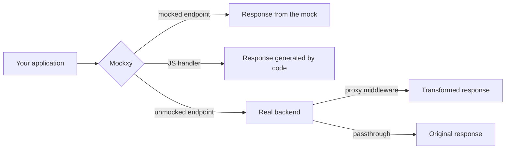

<div align="center">


# Mockxy

[](README.md)
[](README.it.md)

**HTTP mock server with a proxy to your real backend: you mock only the endpoints you need, everything else passes through.**


</div>

---

Mockxy is a mock server built for frontend development: it sits between your application and the backend and answers in place of the backend **only for the routes you decided to mock**. Every other request is forwarded transparently to the real backend, as if Mockxy weren't there.

You don't have to mock everything to get started: begin with zero mocks, work as usual and add one mock at a time — by hand, by importing an OpenAPI spec, or **with one click from a real request captured by the monitor**.

## Table of contents

- [Mockxy](#mockxy)
  - [Table of contents](#table-of-contents)
  - [Why Mockxy](#why-mockxy)
  - [Features](#features)
  - [How it works](#how-it-works)
  - [Quickstart](#quickstart)
  - [Using Mockxy in your project](#using-mockxy-in-your-project)
  - [The web UI](#the-web-ui)
    - [Mock catalog](#mock-catalog)
    - [Monitor](#monitor)
    - [Global controls](#global-controls)
  - [Mocks are files](#mocks-are-files)
  - [Dynamic responses: handlers](#dynamic-responses-handlers)
    - [Reusing saved data: `data()`](#reusing-saved-data-data)
  - [Transforming backend responses: middleware](#transforming-backend-responses-middleware)
  - [OpenAPI import](#openapi-import)
  - [Reusable data: the Data page](#reusable-data-the-data-page)
  - [Configuration](#configuration)
  - [Admin API](#admin-api)
  - [Docker](#docker)
  - [Desktop app](#desktop-app)
  - [Security and limits](#security-and-limits)
  - [Troubleshooting](#troubleshooting)
  - [Repository layout](#repository-layout)
  - [Development and tests](#development-and-tests)
  - [License](#license)

## Why Mockxy

Mockxy was born from situations that sooner or later happen in almost every project. The core idea is that mocking is not an all-or-nothing choice: the boundary between "mocked" and "real" keeps moving throughout the life of a project, and Mockxy is built precisely around that.

- **At the beginning, the backend isn't there.** The API is agreed but not implemented: you mock the endpoints you need and the frontend starts right away. And when the backend matures you don't throw anything away — you disable the mocks one area at a time and those requests simply go back to flowing to the real backend.

- **The staging backend is shared… and every now and then someone resets the database.** You spent the morning entering data through the app's forms to try out the UI, and the scheduled reseeding wipes it all. With Mockxy in between you do your data entry against the real backend, then capture the responses — with your nicely populated data — from the monitor and freeze them into mocks: at the next reset, your scenarios are still there.

- **The contract evolves ahead of the backend.** You update the OpenAPI spec and regenerate the API client, but the real endpoint isn't aligned yet. You intercept the real response, turn it into a mock and add the fields the new contract expects — or you add them on the fly on top of the real response with a middleware, without giving up real data.

- **A case is hard to reproduce.** You need a 500, a timeout, an empty list, a particular dataset: you pin the response of that single endpoint and let everything else pass through.

- **You want to work offline, or isolate yourself from an unstable environment.** Mocks live as files in your repository: the whole response set is reproducible and shareable with your team via git.

None of these is textbook development — no team is perfect. But it's what actually happens, and having a practical way out makes the difference until the backend is stable again. The same scenarios, as step-by-step walkthroughs with links to the detail pages, are in [docs/en/SCENARI.md](docs/en/SCENARI.md).

## Features

- 🎯 **Selective mocks with fallback**: answers with the mocks you defined, forwards the rest to the real backend (or returns 404 in mock-only mode).
- 🖥️ **Full web UI** (English and Italian): mock catalog with collections, response editor, traffic monitor, OpenAPI import.
- 📡 **Real-time monitor**: captures requests and responses (mock and proxy), with filters, export, copy-as-cURL and **mock creation straight from observed traffic**, including in bulk.
- 📁 **Mocks as files**: every endpoint is a folder of readable JSON files, versionable in git and editable by hand, with hot reload.
- 🔀 **Multiple response variants per endpoint**: 200 with data, 404, 500, empty list… and you pick the active one with a switch.
- ⏱️ **Simulated latency**: per-response delay or a global delay to emulate a slow network.
- 📄 **Automatic pagination and filters**: if the body is an array, `?page=0&size=10` returns just the requested page (total in the `X-Total-Count` header) and `?key=value` filters items by equality (case-insensitive by default).
- 🧩 **JavaScript handlers**: when static JSON isn't enough, you generate the response with a function that receives the request's params, query, headers and body.
- 🗂️ **Reusable data files**: upload JSON collections in the Data page and read them from handlers with `data("name")` to serve or reshape them, without pasting them into code.
- 🔧 **Proxy middleware**: intercept the real backend's response and transform it before it reaches your application.
- 📥 **OpenAPI / Swagger import**: from a 3.x or 2.0 spec, generates a mock for every endpoint, with bodies derived from examples and schemas — a solid base to refine by hand.
- 🚦 **Global switches**: suspend all mocks (full proxy) or switch Mockxy off logically without stopping the process.
- 📦 **Three ways to run it**: local Node.js server, Docker container, or a portable Windows desktop app with multi-workspace management.

## How it works



For every incoming request Mockxy looks up the matching endpoint among those defined (method + path, with support for path parameters and the query string; the most specific route always wins). Then:

1. if the endpoint has an active **mock response**, it answers with it (status, headers, body, optional delay);
2. if the active response is a **handler**, it runs your JavaScript code and answers with the result;
3. if there is no mock and the **proxy fallback** is enabled, it forwards the request to `BACKEND_URL` and returns the backend's response — possibly transformed by a **middleware**;
4. if the fallback is disabled it answers `404 Mock Not Found`; if the backend is needed but `BACKEND_URL` is not configured, `501 Backend Not Configured`.

One detail worth knowing: the most specific route for the path is chosen first, then the method is checked. If the selected route doesn't define the requested method, the request goes to the fallback — a less specific route is not searched. The full matching and specificity rules are in [docs/en/PATH.md](docs/en/PATH.md).

**WebSocket** connections don't follow this flow: being a different protocol they have no mocks, and Mockxy forwards them as-is to the backend (requires `BACKEND_URL` and the proxy fallback enabled). That works well for apps that mock their HTTP APIs but keep a live connection to the real backend for notifications or updates. Details in [docs/en/WEBSOCKET.md](docs/en/WEBSOCKET.md).

Every response includes the **`x-mock-source`** header (`mock`, `handler`, `middleware`, `backend`…): it tells you at a glance who produced the response, and it's the first place to look when something doesn't add up. The details of the decision, backend forwarding, errors/timeouts and the full header taxonomy are in [docs/en/PROXY.md](docs/en/PROXY.md).

Two global switches change the behavior on the fly, no restart: **full proxy** (ignores all mocks and forwards everything to the backend, the monitor keeps recording) and **server off** (pure passthrough, without even the monitor).

## Quickstart

Requirements: [Node.js](https://nodejs.org) 24 or later (the current LTS; the desktop and Docker distributions ship their own runtime and don't depend on the system Node).

```bash
git clone https://github.com/<your-user>/mockxy.git
cd mockxy

npm install              # server dependencies
npm run install:frontend # web UI dependencies
cp .env.example .env     # starting configuration

npm run dev:backend      # server on http://localhost:3000
npm run dev:frontend     # web UI on http://localhost:4207 (in a second terminal)
```

The repository ships a demo workspace with a few ready-made mocks, so you can check right away that everything works:

```bash
curl http://localhost:3000/api/hello
# {"hello":"world", ...}
```

Then open **http://localhost:4207** to manage your mocks from the web UI.

> Alternatively you can start with [Docker](#docker) (`docker compose up`) or with the [desktop app](#desktop-app), which requires no installation at all.

## Using Mockxy in your project

The idea is simple: your application must talk to Mockxy instead of the backend, and Mockxy must know where the real backend is.

**1. Point Mockxy at the real backend** in the `.env` file:

```bash
BACKEND_URL=http://localhost:8080
```

**2. Point your app at Mockxy.** If you use your dev server's proxy, no code changes are needed: calls stay relative and only the proxy target changes.

With **Angular** (`proxy.conf.json`):

```json
{
  "/api": {
    "target": "http://localhost:3000",
    "secure": false
  }
}
```

With **Vite** (`vite.config.js`):

```js
export default {
  server: {
    proxy: {
      "/api": "http://localhost:3000"
    }
  }
};
```

Any other client works the same way: just use `http://localhost:3000` as the API base URL.

From this moment on, every call goes through Mockxy: the mocked ones answer with your data, the others reach the real backend. The monitor records them all — and it's the most convenient starting point for creating new mocks. The comparison between the two wiring options (dev-server proxy or direct cross-origin calls) is in [docs/en/FRONTEND.md](docs/en/FRONTEND.md).

## The web UI

<!-- Suggested screenshot: Mocks page with catalog and editor side by side -->

The UI (available in English and Italian) is organized in three main areas.

### Mock catalog

The list of all endpoints, organized in **collections** (nested too, reorderable with drag & drop), with search and filters by method, type and state. For each endpoint you can:

- define method, path (with parameters: `/users/:id`), description;
- create **multiple response variants** and pick the active one: status, headers (with presets for the common cases), JSON/text body with editor and validation, or a binary file;
- set a **delay in milliseconds** to simulate latency;
- enable/disable the single endpoint or a whole collection;
- duplicate an endpoint onto a new method/path.

Collection semantics, editor validations and binary file upload are in [docs/en/CATALOGO.md](docs/en/CATALOGO.md).

### Monitor

The traffic flowing through Mockxy, in real time: method, URL, status, latency and **response origin** (mock, handler, middleware, backend). For every entry you can inspect request and response headers and body, with filters by method, status class (2xx…5xx) and origin — including a combined "Real backend" option for everything that didn't come from your mocks.

This is where the most effective workflow starts: you intercept a real backend response and turn it into a mock with one click, already populated with status, headers and body. It works in bulk on a selection too. It's the fastest way to save the data you entered by hand on a shared environment, before the next database reset takes it away. On top of that: JSON export, copy as cURL, and a direct jump from a request to the mock that served it.

The monitor keeps the last 250 requests in memory and can also stream everything to disk (NDJSON with automatic rotation): the **History** page lets you browse the archive and create mocks in bulk from there as well. Sensitive headers (`Authorization`, `Cookie`, API keys) are masked. Exclusions, capture limits and the traffic→mock rules are in [docs/en/MONITOR.md](docs/en/MONITOR.md); archive activation, rotation and retention in [docs/en/STORICO.md](docs/en/STORICO.md).

### Global controls

From the top bar you can temporarily suspend mocks (**full proxy** to the backend) or switch the server off entirely, plus launch the **OpenAPI import** and change language. The three modes and their effects are in [docs/en/CONTROLLI.md](docs/en/CONTROLLI.md); the language in [docs/en/LINGUA.md](docs/en/LINGUA.md).

## Mocks are files

Everything you do from the UI ends up in plain JSON files inside the mocks folder — and the reverse holds too: you can create and edit mocks by hand with your editor, and Mockxy hot-reloads them. This means the whole mock set is **versionable in git and shareable with your team**. The full folder structure (what you share and what stays local) is documented in [docs/en/WORKSPACE.md](docs/en/WORKSPACE.md).

The layout is one folder per endpoint, mirroring the API path:

```
workspace/mocks/
├── api/users/
│   ├── GET.endpoint.json          # definition of the GET /api/users endpoint
│   └── GET.responses/
│       ├── 001.response.json      # variant: 200 with data
│       └── 002.response.json      # variant: empty list
├── api/users/{id}/
│   ├── GET.endpoint.json          # GET /api/users/:id
│   └── GET.responses/
│       └── 001.response.json
└── .collections.json              # collection layout for the UI
```

The endpoint file declares path, state and available variants (full format, validation rules and error behavior in [docs/en/ENDPOINT.md](docs/en/ENDPOINT.md)):

```json
{
  "method": "GET",
  "path": "/api/users/:id",
  "description": "User detail",
  "enabled": true,
  "responseFiles": ["001.response.json", "002.response.json"],
  "selectedResponseFile": "001.response.json"
}
```

Each response variant is a standalone file (full format of the three types — mock, handler, middleware — in [docs/en/RESPONSE.md](docs/en/RESPONSE.md)):

```json
{
  "type": "mock",
  "title": "User found",
  "status": 200,
  "headers": { "x-example": "true" },
  "delayMs": 150,
  "body": { "id": 1, "name": "Ada", "role": "admin" }
}
```

Instead of `body` you can use `file` to serve a binary payload (images, PDFs…). The file is read from disk **streaming on every request**, without using memory: you can mock downloads of hundreds of MB. If you don't declare a `content-type` in the headers, the response goes out as `application/octet-stream`. The `path` can also include a query string: for the same path, the variant with a matching query takes precedence.

**Automatic pagination.** If a mock's body is an array — or an object with a single top-level array, like `{ "items": [...] }` — you can call it with `?page=0&size=10`: Mockxy returns just the requested page (zero-based) and adds the `X-Total-Count` header with the total number of items. Define the full dataset once and pagination comes for free.

**Automatic filters.** On the same list bodies, every query parameter whose name matches a top-level key of the items filters the list by equality: `?role=admin` returns only the items with that value; different parameters combine with AND, the same parameter repeated is an OR, unknown parameters are ignored. Comparison is case-insensitive by default (configurable per workspace, or with `CASE_INSENSITIVE_FILTERS`), the filter applies before pagination and `X-Total-Count` reports the filtered total. Full rules and edge cases in [docs/en/LISTE.md](docs/en/LISTE.md).

> If you have mocks written in the old v1 format, `node scripts/migrate-mocks-v2.js <folder>` converts them automatically.

## Dynamic responses: handlers

When a static response isn't enough — you want to echo the received body, answer based on a parameter, generate data — a variant can be a **handler**: a JavaScript module that receives the request context and returns the response. No contact with the backend.

```js
// GET.responses/001.handler.js
module.exports = {
  async resolveResponse({ params, query, requestHeaders, jsonBody }) {
    if (!params.id) {
      return { status: 400, jsonBody: { error: "missing id" } };
    }
    return {
      status: 200,
      headers: { "x-generated": "handler" },
      jsonBody: { id: params.id, filter: query, received: jsonBody }
    };
  }
};
```

The context includes the Express request, path parameters, query, headers and body (raw, textual or already parsed as JSON). The result specifies `status`, optional `headers` and a textual `body` **or** a `jsonBody`. Handlers can be created and edited from the UI too, with starter templates. The full contract — context, result format, errors and limits — is in [docs/en/HANDLER.md](docs/en/HANDLER.md).

Handler execution shares the same timeout as backend requests (`REQUEST_TIMEOUT_MS`, default 15 seconds): a handler that doesn't produce a response in time — a promise that never resolves, a fetch without a timeout — gets a **504** with the error logged, instead of leaving the request hanging.

### Reusing saved data: `data()`

The handler context also includes `data`, a function that reads a JSON file from the **Data** page and returns its parsed content. It keeps the dataset out of the code: you define a collection once in a file and read it from one or more handlers, where you filter it, map it, compose it.

```js
module.exports = {
  async resolveResponse({ query, data }) {
    const users = await data("users");            // reads workspace/files/users.json
    const active = users.filter((u) => u.active);
    return { jsonBody: query.q
      ? active.filter((u) => u.name.includes(String(query.q)))
      : active };
  }
};
```

Files are referenced by **name without extension** (`data("users")` → `users.json`); names are always lowercase, and `data` tolerates uppercase or a stray `.json` in the reference. The read happens **only when you call `data()`**: a file never referenced is never opened, and every call re-reads from disk returning an independent copy (file changes show up on the next request, no restarts; mutating the result doesn't touch the file or other handlers). If the file doesn't exist, isn't valid JSON, or the name is malformed, the handler fails with the usual **500** and the details — including *which* files are available — end up in the log.

The same `data()` is available in **proxy middleware** too (see below), to enrich the backend's real response with your own data.

## Transforming backend responses: middleware

The third variant type is the **proxy middleware**: the request really reaches the backend, but before the response goes back to your application you can inspect and modify it. The typical use case is the contract running ahead of the implementation: the backend still answers in the old shape and you add the new fields your client already expects, while keeping real data. It's also handy to fix a payload that isn't aligned yet, or to strip extra headers.

```js
// GET.responses/001.middleware.js
module.exports = {
  async transformResponse({ status, headers, jsonBody }) {
    return {
      status,
      headers: { ...headers, "x-transformed": "true" },
      jsonBody: { ...jsonBody, note: "enriched by Mockxy" }
    };
  }
};
```

Middleware is meant for reasonably sized payloads, typically JSON: the response is buffered up to **10MB** (compressed ones are decoded automatically, with an anti-bomb cap at 50MB) and beyond that limit — or for streams like `text/event-stream` — it reaches your application intact but untransformed, with a log warning and `x-mock-source: backend`. A middleware that fails or times out is **fail-open**: Mockxy logs the error and lets the original backend response through — no request ever hangs because of a middleware. The full `transformResponse` contract — context, header merging, edge cases — is in [docs/en/MIDDLEWARE.md](docs/en/MIDDLEWARE.md).

## OpenAPI import

If you have an **OpenAPI 3.0/3.1 or Swagger 2.0** spec (JSON or YAML), Mockxy can generate a mock for every declared endpoint: path converted to the internal format, first 2xx status as the response, body derived from the spec's examples or sampled from the schemas. Generation rules, incremental import and preview are in [docs/en/OPENAPI.md](docs/en/OPENAPI.md).

The import is designed to give you **a complete working base in seconds**, not perfect mocks: after importing, refine the data that really matters from the editor. The UI shows a preview of what will be created before you confirm (via API, `?dryRun=true`).

## Reusable data: the Data page

The **Data** page collects the JSON files that handlers (and middleware) read with `data("name")` — see [handlers](#reusing-saved-data-data). From here you upload files (`.json` only, in bulk or by drag & drop), review their content, rename or delete them; the "copy reference" button gives you a snippet ready to paste into a handler. Files live in `FILES_DIR` (`workspace/files`) and are versioned like mocks: a demo's dataset travels with the repo. The on-disk contract, `data()` semantics and page details are in [docs/en/DATI.md](docs/en/DATI.md).

Each file shows **which endpoints use it** (recognizing `data("name")` references written as string literals), and the **safe rename** builds on that map: when you rename a referenced file, Mockxy offers to rewrite the occurrences in the sources that use it — an all-or-nothing rewrite, with a final summary and a runtime reload.

The file name **is** its identifier, so it must be unique; to avoid ambiguity across operating systems (Windows and macOS ignore case, Linux doesn't) names are always normalized to lowercase, both on upload and on rename. Content is validated as JSON before being written: a malformed file is rejected without touching the disk.

About sizes: **every `data()` call re-reads the file from disk**, so very large files on busy endpoints are paid on every request — the page flags those above 5 MB; the upload limit is 25 MB.

## Configuration

All configuration goes through environment variables (or a `.env` file; start from `.env.example`, which is commented).

| Variable                       | Default                        | Description                                                                                                                                            |
| ------------------------------ | ------------------------------ | ------------------------------------------------------------------------------------------------------------------------------------------------------ |
| `PORT`                         | `3000`                         | Port the server listens on                                                                                                                             |
| `HOST`                         | `127.0.0.1`                    | Network interface to listen on; `0.0.0.0` to expose on the network (the Docker images set it themselves)                                               |
| `ADMIN_ALLOWED_HOSTS`          | —                              | Extra hostnames allowed in the `Host` header towards the admin API, besides loopback names (DNS-rebinding guard)                                       |
| `BACKEND_URL`                  | —                              | Base URL of the real backend for the proxy fallback; without it, Mockxy runs in mock-only mode                                                         |
| `MOCKS_DIR`                    | `mocks`                        | Folder of the mock definitions (in this repo it points to `workspace/mocks`)                                                                           |
| `FILES_DIR`                    | `files`                        | Folder of the JSON files handlers read via `data()` (in this repo it points to `workspace/files`)                                                      |
| `PROXY_FALLBACK_ENABLED`       | `true`                         | Forward unmocked requests to the backend (`false` = 404)                                                                                               |
| `CORS_ENABLED`                 | `false`                        | Automatic CORS handling for browser frontends on another origin (see below)                                                                            |
| `ADAPT_PROXY_COOKIES`          | `true`                         | Adapts the proxied backend's `Set-Cookie` to the topology with Mockxy in the middle (see below)                                                        |
| `REWRITE_PROXY_REDIRECTS`      | `true`                         | Rewrites proxied redirects pointing at the backend, so the browser stays on Mockxy (see below)                                                         |
| `ADMIN_API_ENABLED`            | `true` in dev, `false` in prod | Enables the admin API under `/_admin/api`                                                                                                              |
| `UI_DIST_DIR`                  | —                              | Folder of the compiled UI to serve under `/_admin/ui` (used by the desktop app)                                                                        |
| `DEV_WATCH`                    | `true`                         | Hot reload of mocks on file changes (never active in production)                                                                                       |
| `CHOKIDAR_USEPOLLING`          | `false`                        | Polling watcher instead of native events: needed where events don't arrive (Docker, network shares)                                                    |
| `REQUEST_TIMEOUT_MS`           | `15000`                        | Timeout towards the backend (up to the first response headers: started streams have no inactivity timeout) and for local handlers and proxy middleware |
| `LOG_LEVEL`                    | `info`                         | Log verbosity (`error`, `warn`, `info`, `debug`)                                                                                                       |
| `MONITOR_DUMP_DIR`             | `monitor-dump`                 | Folder where the monitor archives traffic to disk                                                                                                      |
| `MONITOR_DUMP_INTERVAL_MS`     | `30000`                        | Archive write interval                                                                                                                                 |
| `MONITOR_DUMP_THRESHOLD`       | `100`                          | Early write when N requests are queued                                                                                                                 |
| `MONITOR_DUMP_MAX_FILE_BYTES`  | `52428800`                     | Maximum size of each archive file (50 MB, then rotation)                                                                                               |
| `MONITOR_DUMP_MAX_TOTAL_BYTES` | `1073741824`                   | Cap on the archive folder total (1 GB): beyond it, oldest files are deleted; `0` = never                                                               |

To simulate a slow network there are two launch options:

```bash
npm run dev:backend -- --delay=500     # 500 ms on every mock without its own delayMs
npm run dev:backend -- --delay-all     # apply the delay to proxied requests too
```

(In Docker Compose the same options are controlled with `MOCKXY_DELAY` and `MOCKXY_DELAY_ALL`; levels, precedence and details in [docs/en/RITARDI.md](docs/en/RITARDI.md).)

**CORS.** By default Mockxy doesn't handle CORS, and in the recommended setup (dev-server proxy, non-browser clients) you never need it. `CORS_ENABLED=true` (the «Automatic CORS» switch in the workspace dialog) is for when a browser frontend calls Mockxy **directly from another origin** — even just `localhost:4200` towards `localhost:3000`, because the port counts for the origin. When enabled, the CORS policy of everything leaving Mockxy is Mockxy's own: preflights handled automatically, origin reflected with credentials allowed, overriding CORS headers saved in captured mocks and on proxied responses as well. Details in [docs/en/CORS.md](docs/en/CORS.md).

**Cookies and sessions through the proxy.** For a cookie session to work, the login must go through Mockxy and the backend's `Set-Cookie` must survive the trip: by default (`ADAPT_PROXY_COOKIES`, the «Adapt proxied cookies» switch) Mockxy removes the attributes the browser would reject coming from Mockxy over http — `Domain`, `Secure`, `SameSite=None` — without touching name, value and the rest. The full session journey and the remaining limits (cross-site cookies over http: use the token) are in [docs/en/COOKIE.md](docs/en/COOKIE.md).

**Redirects through the proxy.** An absolute backend redirect to its own address would take the browser out of Mockxy (and out of cookies, CORS and the proxy): by default (`REWRITE_PROXY_REDIRECTS`, the «Rewrite proxied redirects» switch) `Location` values pointing at the `BACKEND_URL` origin are mapped back to Mockxy's address, preserving path and query; relative redirects and those to third-party hosts (SSO, CDN) pass through untouched. Details in [docs/en/REDIRECT.md](docs/en/REDIRECT.md).

## Admin API

Everything the web UI does goes through a REST API under `/_admin/api`: CRUD for mocks, variants and collections, monitor (with Server-Sent Events streaming), OpenAPI import, global switches. You can therefore automate any operation (the full route reference is in [docs/en/ADMIN-API.md](docs/en/ADMIN-API.md)):

```bash
# server state
curl http://localhost:3000/_admin/api/server

# suspend mocks: full proxy to the backend
curl -X PATCH http://localhost:3000/_admin/api/server \
  -H "content-type: application/json" -d '{"proxyAll": true}'

# preview an OpenAPI import without creating anything
# (explicit content-type required: application/yaml or application/json;
#  text/plain is rejected with 415 as an anti-CSRF defense)
curl -X POST "http://localhost:3000/_admin/api/mocks/import/openapi?dryRun=true" \
  -H "content-type: application/yaml" --data-binary @openapi.yaml
```

The API is enabled by default only in development and is designed for local use: don't expose it on untrusted networks.

## Docker

The comparison of the ways to run Mockxy (direct, development compose, standalone image) is in [docs/en/DEPLOYMENT.md](docs/en/DEPLOYMENT.md). For the full development environment (server + web UI):

```bash
docker compose up
# server on http://localhost:3000, web UI on http://localhost:4207
```

It works on a fresh clone without a `.env` too (the file is optional: it's read if present, otherwise defaults apply); Docker Compose v2.24 or later is required. Mocks stay mounted from the local filesystem, so hot reload and git versioning work just like the direct run.

There is also a **standalone** image (`Dockerfile.standalone`, used by `docker-compose.staging.yml`) that serves *only* the mocks: no admin API, no monitor, no proxy fallback. It's designed for shared test environments or demos on a server. The image contains **the engine only** — you distribute the application, not the workspace: mocks and the Data page's **data files** are mounted at runtime as bind mounts (the sample compose mounts `workspace/mocks` and `workspace/files` read-only), so handlers using `data()` keep working and mocks update without a rebuild. The workspace's local part (`.mockxy`: desktop app settings and captured traffic) must not be mounted: per-workspace settings are read only by the desktop app — the headless flavor is configured exclusively through environment variables.

## Desktop app

Mockxy is also available as a **Windows desktop app** (Electron): a single portable executable, no installation, with server and UI built in. The workspace bar, ports, settings dialog and packaging are in [docs/en/DESKTOP.md](docs/en/DESKTOP.md).

On top of the web version:

- **Multiple workspaces in parallel**, each with its own mocks folder, its own port and its own backend, managed as tabs in the UI;
- each workspace is a plain folder containing `mockxy.json`, the mocks and the data files (to version in git and share with your team) plus a local `.mockxy/` subfolder (personal settings and monitor archive, already git-excluded) — full anatomy in [docs/en/WORKSPACE.md](docs/en/WORKSPACE.md);
- the server listens on loopback only and preferences are saved next to the executable.

To build the executable:

```bash
npm run install:all
npm run dist:electron
# output in electron/dist/Mockxy-<version>-portable.exe
```

> **Note:** the executable is not digitally signed, so on first launch Windows SmartScreen may show a warning ("More info" → "Run anyway").

## Security and limits

Mockxy is a development tool, meant to run locally or on a server controlled by your team. Keep in mind:

- the admin API **has no authentication**, writes files to disk and executes JavaScript: whoever reaches it can run code on the machine. That's why by default the server listens on `127.0.0.1` only (and the admin API is off in production); if you expose with `HOST=0.0.0.0` on an untrusted network, turn the admin off with `ADMIN_API_ENABLED=false` — at startup a log warning flags the admin + network-interface combination;
- on the loopback bind the admin API only accepts requests whose `Host` header is a loopback name (plus any `ADMIN_ALLOWED_HOSTS`): that's the defense against DNS rebinding, the attack where a hostile site re-resolves its domain to `127.0.0.1` to drive the admin from your browser. If you use a local alias (e.g. in `/etc/hosts`), add it to `ADMIN_ALLOWED_HOSTS`. The full picture of binding and exposure is in [docs/en/RETE.md](docs/en/RETE.md);
- handlers and middleware are **JavaScript executed locally**: don't open workspaces you don't trust, for the same reason you don't run arbitrary scripts;
- the monitor masks sensitive headers, but bodies and query strings can still contain personal data or secrets — and they also end up in the on-disk archives, which must stay out of git;
- proxy middleware buffers the backend response in memory up to 10MB: beyond the limit, and for streams (`text/event-stream`), the response reaches your application intact but **untransformed**;
- **WebSockets** (and other upgrade requests) cross Mockxy as **pure passthrough** to the backend: they don't go through mocks, handlers or middleware — they're meant for apps that mock their HTTP APIs but keep a live connection for notifications or updates. They require `BACKEND_URL` configured and the proxy fallback enabled; in mock-only mode the upgrade is not forwarded;
- to publish a mock set to a wider audience use the standalone Docker image, which disables the admin API, the proxy and file reloading.

## Troubleshooting

The extended version, symptom by symptom with links to the detail pages, is in [docs/en/TROUBLESHOOTING.md](docs/en/TROUBLESHOOTING.md). The most frequent cases:

- **A mock doesn't answer and the request reaches the backend** — check the `x-mock-source` header and the Monitor page: it's almost always a difference in method, path (watch out for prefixes like `/api`) or query string, or the endpoint is disabled, or another variant is selected.
- **`501 Backend Not Configured`** — the request was meant for the backend but `BACKEND_URL` isn't set: configure it, or disable the fallback with `PROXY_FALLBACK_ENABLED=false`.
- **`502 Bad Gateway`** — the backend is unreachable or didn't start answering within `REQUEST_TIMEOUT_MS`. Once the response has started the timeout no longer applies: if the backend dies mid-stream, the client sees a network error (explicit truncation), not a 502.
- **`504 Handler Timeout`** — a local handler didn't produce a response within `REQUEST_TIMEOUT_MS`: there's almost always a promise that never resolves inside (e.g. a fetch without a timeout); the offending file is named in the log.
- **The middleware doesn't transform the response** — if the response exceeds 10MB or is a stream (`text/event-stream`), Mockxy lets it through untouched without applying the middleware: `x-mock-source` is `backend` instead of `middleware` and the log has a warning with the reason.
- **File changes are not reloaded** — happens where native filesystem events don't arrive (Docker with mounted volumes, network shares): enable the polling watcher with `CHOKIDAR_USEPOLLING=true`.
- **An invalid mock file** doesn't stop the server: Mockxy keeps the last valid configuration, reports the error in the logs and retries on the next save.

## Repository layout

```
├── index.js             # server entry point
├── src/                 # engine: routing, proxy, monitor, admin API, OpenAPI import
├── mockxy-ui/           # web UI (Angular)
├── electron/            # desktop app (Electron)
├── workspace/           # demo workspace with example mocks
├── scripts/             # utilities (dev server, mock format migration, test-drive environment)
├── test/                # engine and desktop-module tests (Jest)
├── e2e/                 # end-to-end UI↔engine tests (Playwright)
├── docs/                # per-feature documentation (docs/en, docs/it + internal folders)
└── archived/            # completed plans and reviews (internal history only)
```

## Development and tests

```bash
npm test                 # all Jest tests: engine + desktop-app modules
npm run test:backend     # engine only (src/)
npm run test:electron    # desktop shell Node modules only (electron/)
npm run test:frontend    # web UI tests
npm run test:e2e         # end-to-end UI↔engine (Playwright; builds the UI itself)
npm run build:frontend   # production build of the UI
```

There is also an **external black-box acceptance suite**
([mock-server-acceptance-tests](https://github.com/tosdan/mockxy-acceptance-tests)):
it exercises the standalone Docker image with a real browser in the «browser → Mockxy →
backend» topology (CORS, cookies, redirects, WebSocket, streaming, hot reload). It runs in CI
on every push to this repo (the `acceptance` workflow) and on the suite's own repo.

Contributions are welcome: see [CONTRIBUTING.md](CONTRIBUTING.md) for the guidelines.

## License

Distributed under the **GNU GPL v3 or later** license. See [LICENSE](LICENSE) for the full text.
