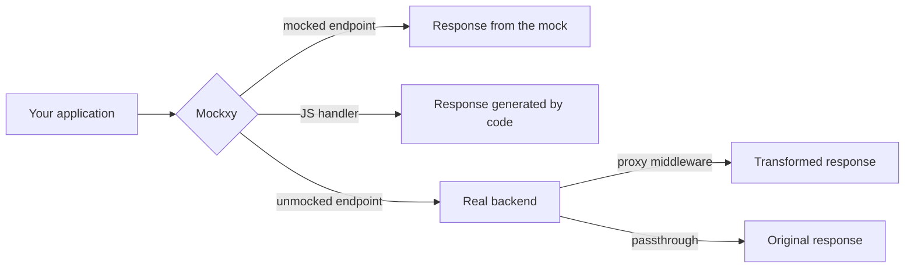

# 01 — What Mockxy is and why you'd use it

Mockxy is an HTTP mock server built for frontend development, designed around one precise
idea: **you don't have to mock everything**. It sits between your application and the
backend, answers in place of the backend only for the endpoints you decided to mock, and
forwards everything else to the real backend transparently — as if Mockxy weren't there.

This guide walks through every feature of the application, in order: it starts from
installation and reaches the advanced scenarios (JavaScript handlers, SSE and WebSocket
streaming, API automation). The chapters read well in sequence, but each one stands on its
own: if you are looking for a specific feature, the [guide index](README.md) and the
"where do I do what" appendix take you straight to the right chapter.

> 📷 **SCREENSHOT** — `01-panoramica-app.png`
> What to show: the application open on the Catalog view, with a workspace populated by
> realistic endpoints organized into collections (e.g. `users`, `orders`) and the panel of
> a selected endpoint on the right. This is the guide's "cover": it should convey the big
> picture, not illustrate a specific feature.

## The problem

Anyone building a frontend depends on a backend that is rarely in ideal shape. Some
recurring situations:

- **The backend doesn't exist yet.** The API is agreed, maybe an OpenAPI spec already
  exists, but the implementation is weeks away. The frontend has to start now.
- **The shared staging environment is unstable.** Data entered by hand to try out the
  screens vanishes at the first database reseeding; someone else's deploy breaks the
  endpoint you were using; the environment is slow or unreachable exactly when you need it.
- **The contract moves ahead of the backend.** The spec has been updated and the API
  client regenerated, but the real endpoint still answers in the old shape: the new
  frontend has nothing real to talk to.
- **A case is hard to reproduce.** You need a 500, a timeout, an empty list, a user in a
  particular state — and the real environment won't produce it on demand.
- **You need to work offline**, or simply isolate yourself from an environment that isn't
  cooperating today.

Classic mock servers answer these problems with a heavy trade-off: either you mock the
whole API (and maintain it by hand, forever), or you mock nothing. Mockxy removes the
trade-off.

## The idea: a movable boundary between mocked and real

Mockxy works as a **proxy with fallback**. Every request from your application reaches
Mockxy; if a mock exists for that endpoint, the mock answers; otherwise the request
continues to the real backend and the response comes back untouched.

The boundary between "mocked" and "real" is therefore not a project decision made once and
for all: it is a line that **moves one endpoint at a time**, in both directions, throughout
the life of the project. At the beginning it may be all mocks because the backend isn't
there; then the backend matures and mocks get disabled one area at a time, with those
requests simply flowing back to the real backend; later you need a 500 on a single
endpoint, and for one afternoon that one endpoint becomes a mock again.

As the diagram shows, there are four ways to answer, and the guide covers each in depth:

- **Static mock** — the response is described in a JSON file: status, headers, body. It is
  the base case, and it covers more than it seems thanks to templating, automatic
  pagination and variant sequences (chapters 9–12).
- **Handler** — the response is computed by a local JavaScript script that receives the
  request: for the cases that need logic or state (chapter 15).
- **Middleware** — the request really reaches the backend, but the response passes through
  a script that can transform it before it reaches the application: real data, touched up
  (chapter 16).
- **Passthrough** — no mock: the request goes to the backend and the response comes back
  untouched. It is the default behavior for everything you haven't mocked.

On top of these come the mocks for the streaming protocols — **Server-Sent Events** and
**WebSocket** — with timed scripts and manual-direction consoles (chapters 18–19).

## Not just mocks: observing and capturing

The other half of Mockxy is the **monitor**: the real-time view of all the traffic that
crosses the server, mocked and proxied. Besides being the main diagnostic tool (what came
in, who answered, with what latency), the monitor lets you **turn a real response into a
mock with one click** — in bulk too, across several selected requests.

It is Mockxy's most distinctive workflow: you navigate your application against the real
backend, watch the traffic go by, and freeze into mocks the responses you need — for
example the data you just entered by hand on a shared staging server, before the next
database reset takes it away. Chapters 20–22 cover the monitor, capture and the persistent
history.

One last distinctive trait: **mocks are files**. Every operation performed in the interface
writes plain, readable JSON files into a folder — the *workspace* — which can be versioned
in git and shared with the team. The reverse also holds: the files can be edited by hand
with any editor, and Mockxy hot-reloads them. Chapter 24 opens the hood.

## What Mockxy is not

To set expectations:

- **It is not an automated testing tool.** It defines no assertions and verifies no
  contracts; it does integrate well with e2e tests, though, which can drive it via its API
  — for instance to select an endpoint's error variant before a test (chapter 30).
- **It is not a production API gateway.** It is a development tool: the admin API has no
  authentication and the server, by default, listens only on the local machine. To serve
  mocks to others there is a dedicated Docker image, stripped down to pure serving
  (chapters 29 and 31).
- **It does not generate realistic data out of thin air.** The OpenAPI import produces
  plausible, immediately working mocks, but the data that matters for your flows is yours
  to refine — from the interface, or by capturing it from real traffic.

## How it runs

Mockxy is used in three forms, all with the same core features:

- a portable **desktop app** for Windows — no installation, engine and interface bundled,
  and the ability to manage several workspaces in parallel;
- a local **Node.js server**, with the web interface in the browser;
- a **Docker container**, including a ready-to-use development compose file.

Choosing between them, and the startup steps, are the subject of
[chapter 3](03-install-and-run.md). First, though, it pays to fix the vocabulary and
understand how Mockxy decides who answers each request: that is
[chapter 2](02-core-concepts.md).
