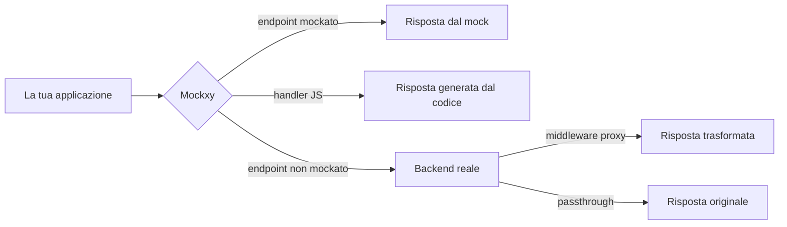

# 01 — Cos'è Mockxy e perché usarlo

Mockxy è un mock server HTTP pensato per lo sviluppo frontend, costruito attorno a un'idea
precisa: **non devi mockare tutto**. Si mette tra la tua applicazione e il backend, risponde
al posto del backend solo per gli endpoint che hai deciso di mockare, e inoltra tutto il resto
al backend reale in modo trasparente — come se Mockxy non ci fosse.

Questa guida percorre tutte le funzionalità dell'applicazione, in ordine: si parte
dall'installazione e si arriva agli scenari avanzati (handler JavaScript, streaming SSE e
WebSocket, automazione via API). I capitoli si leggono bene in sequenza, ma ognuno è
autosufficiente: se cerchi una funzione specifica, l'[indice della guida](README.md) e
l'appendice «dove si fa cosa» ti portano dritto al capitolo giusto.

> 📷 **SCREENSHOT** — `01-panoramica-app.png`
> Cosa mostrare: l'applicazione aperta sulla vista Catalogo, con un workspace popolato da
> endpoint realistici organizzati in collection (es. `utenti`, `ordini`) e la scheda di un
> endpoint selezionata a destra. È la "copertina" della guida: deve dare l'idea d'insieme,
> non illustrare una funzione specifica.

## Il problema

Chi sviluppa un frontend dipende da un backend che raramente è nelle condizioni ideali.
Alcune situazioni ricorrenti:

- **Il backend non esiste ancora.** L'API è concordata, magari c'è già una specifica OpenAPI,
  ma l'implementazione arriverà tra settimane. Il frontend però deve partire adesso.
- **L'ambiente di staging è condiviso e instabile.** I dati inseriti a mano per provare le
  interfacce spariscono al primo reseeding del database; un deploy altrui rompe l'endpoint
  che stavi usando; l'ambiente è lento o irraggiungibile proprio quando serve.
- **Il contratto evolve prima del backend.** La specifica è stata aggiornata e il client API
  rigenerato, ma l'endpoint reale risponde ancora nel formato vecchio: il frontend nuovo non
  ha nulla di reale con cui parlare.
- **Un caso è difficile da riprodurre.** Serve un errore 500, un timeout, una lista vuota, un
  utente in uno stato particolare — e l'ambiente reale non lo produce su richiesta.
- **Serve lavorare offline**, o comunque isolarsi da un ambiente che oggi non collabora.

I mock server classici rispondono a questi problemi con un compromesso pesante: o si mocka
tutta l'API (e la si mantiene allineata a mano, per sempre), o non si mocka niente. Mockxy
rimuove il compromesso.

## L'idea: un confine mobile tra mockato e reale

Mockxy funziona da **proxy con fallback**. Ogni richiesta della tua applicazione arriva a
Mockxy; se esiste un mock per quell'endpoint, risponde il mock; altrimenti la richiesta
prosegue verso il backend reale e la risposta torna indietro intatta.

Il confine tra "mockato" e "reale" non è quindi una scelta di progetto fatta una volta per
tutte: è una linea che **si sposta un endpoint alla volta**, in entrambe le direzioni, durante
tutta la vita del progetto. All'inizio magari è tutto mock perché il backend non c'è; poi il
backend matura e i mock si disabilitano una zona alla volta, e quelle richieste tornano
semplicemente a fluire verso il backend reale; più avanti serve un 500 su un singolo endpoint,
e per un pomeriggio quel solo endpoint torna mock.

Come si vede nel diagramma, i modi di rispondere sono quattro, e la guida li approfondisce
uno per uno:

- **Mock statico** — la risposta è descritta in un file JSON: status, header, body. È il caso
  base, e copre più di quanto sembri grazie a templating, paginazione automatica e sequenze
  di varianti (capitoli 9–12).
- **Handler** — la risposta è calcolata da uno script JavaScript locale che riceve la
  richiesta: per i casi in cui serve logica o stato (capitolo 15).
- **Middleware** — la richiesta arriva davvero al backend, ma la risposta passa da uno script
  che può trasformarla prima che raggiunga l'applicazione: dati reali, ritoccati (capitolo 16).
- **Passthrough** — nessun mock: la richiesta va al backend e la risposta torna intatta. È il
  comportamento di default per tutto ciò che non hai mockato.

A questi si aggiungono i mock per i protocolli di streaming — **Server-Sent Events** e
**WebSocket** — con copioni temporizzati e console di regia manuale (capitoli 18–19).

## Non solo mock: osservare e catturare

L'altra metà di Mockxy è il **monitor**: la vista in tempo reale di tutto il traffico che
attraversa il server, mockato e proxato. Oltre a essere lo strumento di diagnosi principale
(cosa è arrivato, chi ha risposto, con che latenza), il monitor permette di **trasformare in
mock una risposta reale con un click** — anche in blocco, su più richieste selezionate.

È il flusso di lavoro più caratteristico di Mockxy: navighi la tua applicazione contro il
backend vero, guardi il traffico passare, e congeli in mock le risposte che ti servono — ad
esempio i dati appena inseriti a mano su uno staging condiviso, prima che il prossimo reset
del database se li porti via. I capitoli 20–22 coprono monitor, cattura e archivio storico.

Un ultimo tratto distintivo: **i mock sono file**. Ogni operazione fatta dall'interfaccia
scrive normali file JSON leggibili in una cartella — il *workspace* — versionabile in git e
condivisibile con il team. Vale anche il contrario: i file si possono modificare a mano con
qualunque editor, e Mockxy li ricarica a caldo. Il capitolo 24 apre il cofano.

## Cosa non è Mockxy

Per inquadrare le aspettative:

- **Non è uno strumento di test automatico.** Non definisce asserzioni né verifica contratti;
  però si integra bene con i test e2e, che possono pilotarlo via API — ad esempio per
  selezionare la variante d'errore di un endpoint prima di un test (capitolo 30).
- **Non è un API gateway di produzione.** È uno strumento di sviluppo: l'API di
  amministrazione non ha autenticazione e il server, di default, ascolta solo sulla macchina
  locale. Per servire mock ad altri esiste un'immagine Docker dedicata, ridotta alla sola
  erogazione (capitoli 29 e 31).
- **Non genera dati realistici dal nulla.** L'import OpenAPI produce mock plausibili e subito
  funzionanti, ma i dati che contano per il tuo flusso li rifinisci tu — dall'interfaccia o
  catturandoli dal traffico reale.

## Come si esegue

Mockxy si usa in tre forme, tutte con le stesse funzionalità di base:

- **app desktop** portable per Windows — nessuna installazione, motore e interfaccia
  integrati, e la gestione di più workspace in parallelo;
- **server Node.js** in locale, con l'interfaccia web nel browser;
- **container Docker**, incluso un compose di sviluppo pronto all'uso.

La scelta e i passi di avvio sono il tema del [capitolo 3](03-installazione-avvio.md). Prima,
però, conviene fissare il vocabolario e capire come Mockxy decide chi risponde a ogni
richiesta: è il [capitolo 2](02-concetti-fondamentali.md).
